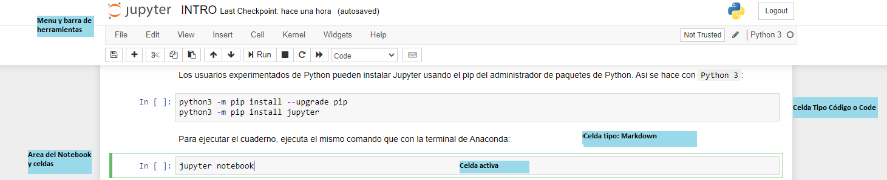
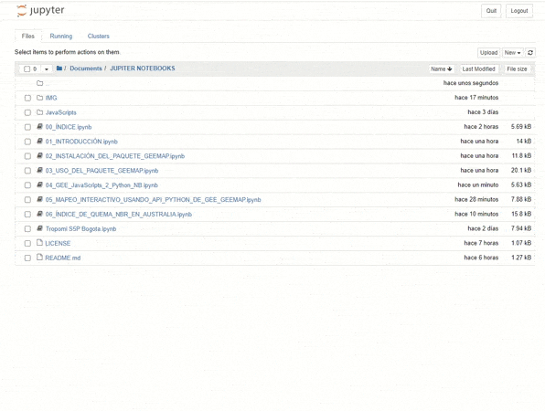
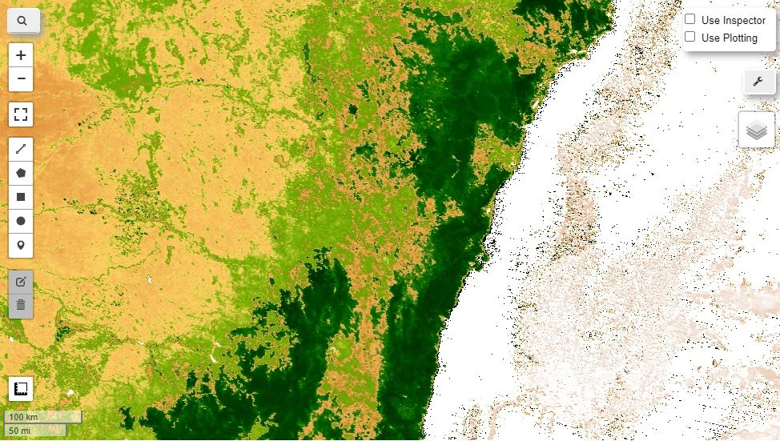

# FOREST FIRES ON JUPYTER Notebooks-geemap
</img>
 
</img>
 . 

 

 Ejecicicos en español sobre Jupyter Notebook y geemap para el monitoreo de incendios forestales
# Incendios Forestales en GEE mediante el paquete geemap
Aplicaciones en Google Earth Engine para el monitoreo y manejo de Incendios Forestales.
# 1. Descripción
La siguiente es una colección de scripts básicos, explicados en **español** para el procesamiento digital de imágenes en [**Google Earth Engine (GGE)**](https://earthengine.google.com/), con el fin de poder trabajar con datos de forma masiva en la nube mediante software de código abierto, como alternativa alos software propietarios de escritorio.
Todos los desarrollos descritos a continuación son parte del trabajo desarrollado dentro de la estancia científica 
en [UNSPIDER](https://www.un-spider.org) (oficina de Bonn -Alemania), Febrero de 2020.
Este repositorio es una colección de ejemplos earthengine en Jupyter Notebook en Python. Tambien se pueden ver las capas de datos de Earth Engine de forma interactiva en las notebooks Jupyter sin tener que instalar QGIS. En estos ejemplos se están utilizando varios paquetes de Python, incluidos Earth Engine Python API, folium, ipyleaflet y geemap. El paquete geemap Python se basa en los paquetes folium e ipyleaflet e implementa varios métodos para interactuar con las capas de datos de Earth Engine, como `Map.addLayer`, `Map.setCenter`, `Map.centerObject` y `Map.setOptions`. 

# Ejercicios básicos de procesamiento digital en Jupyter Notebook

Esta colección se basa en cuadernos Jupyter o [**Jupyter Notebook**](https://jupyter.org/), que permiten un alto nivel de aprendizaje interactivo, ya que el código, su descripción y la visualización se combinan en un solo lugar. Si no ha trabajado antes con los Cuadernos Jupyter, puede consultar el módulo [Introducción a Python y Project Jupyter](./01_INTRODUCCIÓN.ipynb) para obtener una breve introducción a los cuadernos Jupyter y sus beneficios.

Material organizado por el [**Alexander Ariza**](https://www.researchgate.net/profile/Alexander_Ariza2), como apoyo al portal de conocimiento de la oficina de [**UNSPIDER**](https://www.un-spider.org), 2020.

# ÍNDICE GENERAL
A continuación podrá encontrar los siguientes contenidos: 

**I - INTRODUCCIÓN**

* [1 - Introducción a Python y Project Jupyter](./01_INTRODUCCIÓN.ipynb) *(opcional)*

**II - INSTALACIÓN DE PAQUETES Y LIBRERÍAS**

* [2 - Instalación del paquete geemap](./02_INSTALACIÓN_DEL_PAQUETE_GEEMAP.ipynb)

* [3 - Uso del paquete geemap](./03_USO_DEL_PAQUETE_GEEMAP.ipynb)

**II - PROCESOS Y HERRAMIENTAS BÁSICAS**

* [4 - Convertir JavaScripts de GEE a Python3 y cuadernos NB](./04_GEE_JavaScripts_2_Python_NB.ipynb)
* [5 - Mapa Interactivo Usando la API geemap en Python3](./05_MAPEO_INTERACTIVO_USANDO_API_PYTHON_DE_GEE_GEEMAP.ipynb)

**III - CASOS DE ESTUDIO**

* [6 - Índice de Área Quemada (NBR) de MODIS en Australia](./06_ÍNDICE_DE_QUEMA_NBR_EN_AUSTRALIA.ipynb)

**NOTA:** El contenido de estos cuadernos esta orientado a definir algunas funciones generales para cargar, explorar, procesar y visualizar los conjuntos de datos.

Material organizado por el [**Alexander Ariza**](https://www.researchgate.net/profile/Alexander_Ariza2), como apoyo al portal de conocimiento de la oficina de [**UNSPIDER**](https://www.un-spider.org), 2020.

</img>
 
## 1. INTRODUCCIÓN

### **¿Que es Jupyter?**

El Proyecto Jupyter es una organización sin ánimo de lucro creado por [Fernando Pérez](https://es.wikipedia.org/wiki/Fernando_P%C3%A9rez_(programador)) , [Brian Granger](https://blog.jupyter.org/@ellisonbg) para "desarrollar software de código abierto, mediante estándares abiertos y servicios para computación interactiva en docenas de lenguajes de programación".

</img>

"El nombre del **proyecto Jupyter o Project Jupyter** es una referencia a los tres lenguajes de programación principales soportados por Jupyter, que son `Julia`, `Python` y `R`".

 
A continuación, veremos una breve descripción del entorno de Jupyter, con énfasis en **Jupyter Notebook**, para el desarrollo de ejercicios de PDI en **GEE** y el paquete **geemap**.

### Project Jupyter
Project Jupyter ofrece diferentes herramientas para facilitar la informática interactiva, ya sea con una aplicación basada en la web (`Jupyter Notebooks`), un entorno de desarrollo interactivo (`JupyterLab`) o mediante un `JupyterHub` que lleva la informática interactiva a grupos de usuarios.

<b><i>
 
 "Project Jupyter es una plataforma web que permite desarrollar software de código abierto, estándares abiertos y servicios para computación interactiva en docenas de lenguajes de programación."</i></b>

### Instalando Jupyter con pip
Los usuarios experimentados de Python pueden instalar Jupyter usando el pip del administrador de paquetes de Python.
#Asi se hace con `Python 3`:
python3 -m pip install --upgrade pip
python3 -m pip install jupyter
#Para ejecutar el cuaderno, ejecuta el mismo comando que con la terminal de Anaconda:
jupyter notebook
## Interfax de Jupyter notebooks
Esta es la descripción general de la Interfax `Jupyter Notebook`, en donde encontraras entre otras opciones:

* Tablero de control de Notebook
 * Creando un nuevo notebook
* Notebook editor (UI)
 * Menu
 * Barra de herramientas
 * Notebook areas y celdas
* Tipo de celdas
 * Code
 * Markdown

 

<figure>
    <figcaption><i> Interfax de usuario del editor de Notebook (GUI)</i></figcaption>
</figure>

### Atajos en Notebook
Obtenga una descripción general de los accesos directos presionando 'H' o vaya a la ayuda: `Help/Keyboard shortcuts`
#### Atajos más comunes:
Presionando la tecla `shift` más una de las siguientes teclas, podrá ir a los comandos más comunes:
* `Esc` - Cambiar a modo de comando
* `B` - Insertar debajo
* `A` - Insertar encima
* `M` - Cambiar celda actual a Markdown
* `Y` - Cambiar celda actual a code
* `DD` - Borrar celda
* `Enter` - Regresar al modo de edición
* `Esc + F` - Encontrar y reemplazar su código
* `Shift + Down / Upwards` - Seleccione multiples celdas
* `Shift + M` - Unir multiples celdas

## Celdas mágicas
Los comandos mágicos pueden hacer tu vida mucho más fácil, ya que solo tienes un comando en lugar de una función completa o varias líneas de código. , e.g:
> Ir a un [Comando de extensión o vinculo (ejemplo:cargar nueva ventana)]()
### Algunos ejemplos de celdas mágicas
**Descripción general:**
%lsmagic
**Ver y aparecer variables de entorno:**
%env
**Instalar y enumerar bibliotecas:**
!pip install numpy
!pip list | grep pandas
Escribir el contenido de una celda en un archivo Python:
%%writefile hello_world.py

print('Hola Mundo')

Cargar un archivo Python:
%pycat hello_world.py
Obtener el tiempo de ejecución:
%%time

tmpList = []
for i in range(100):
    tmpList.append(i+i)

print(tmpList)

Mostrar gráficos de matplotlib en línea:
%matplotlib inline
## Compartir tus Jupyter Notebooks
* [nbviewer](https://nbviewer.jupyter.org/) - Una forma sencilla de compartir cuadernos Jupyter, es simplemente pegando la ubicación de GitHub de su computadora portátil Jupyter allí y se muestra muy bien. 
* [GitHub](https://github.com/) - GitHub ofrece una representación interna de los cuadernos Jupyter. Existen algunas limitaciones y retrasos en el tiempo de la representación adecuada. Por lo tanto, sugeriríamos usar nbviewer para compartir cuadernos Jupyter bien representados.

### Reproducción de Jupyter Notebooks
</img>
[Binder](https://mybinder.org/) le permite abrir cuadernos alojados en un repositorio de Git en un entorno ejecutable, haciendo que el código sea reproducible inmediatamente por cualquier persona, en cualquier lugar.

Binder crea una imagen de Docker del repositorio donde se alojan los cuadernos.
### Otros recursos disponibles
* [Project Jupyter](https://jupyter.org/)
* [JupyterHub](https://jupyterhub.readthedocs.io/en/stable/)
* [JupyterLab](https://jupyterlab.readthedocs.io/en/stable/)
* [nbviewer](https://nbviewer.jupyter.org/)
* [Binder](https://mybinder.org/)
* [Google Colaboratory](https://colab.research.google.com/notebooks/intro.ipynb)
## 2. INSTALACIÓN DEL PAQUETE "Geemap"
<a href="https://colab.research.google.com/github/Alexanderariza/FOREST-FIRES-ON-GEE-GEEMAP/blob/master/.ipynb_checkpoints/02_INSTALACI%C3%93N%20DEL%20PAQUETE%20GEEMAP-checkpoint.ipynb"></img>
 
### Introducción
geemap está destinado a estudiantes e investigadores, a quienes les gustaría utilizar el ecosistema Python de diversas bibliotecas y herramientas para explorar Google Earth Engine. También está diseñado para usuarios de GEE existentes que deseen realizar la transición de la API de JavaScript de GEE a la API de Python. Para ello, se explicara el módulo de conversión automatizado de JavaScript a Python del paquete geemap desarrollado por el Profesor Qiusheng Wu, lo que puede reducir en gran medida el tiempo necesario para convertir los JavaScripts GEE existentes en scripts Python y portátiles Jupyter.
### Instalación
</img>.

  **geemap** también está disponible en conda-forge. Si tiene instalado Anaconda o Miniconda en su computadora, puede crear un entorno conda Python para instalar geemap.

## 3. USO DEL PAQUETE "Geemap"
A continuación, se describen las funciones mas generales dispuestas en el paquete **geemap**: 
###a) Creando un mapa interactivo con el paquete "geemap" para GEE.

###b) Principales funciones con el paquete "geemap" para GEE.

## 4. CONVERSIÓN AUTOMÁTICA DE GEE - Javascripts a Python y Jupyter

Los siguientes ejemplos requieren el paquete **geemap**, que puede instalarse utilizando `pip install geemap`. Consulte la sección de <a href="./02_INSTALACIÓN_DEL PAQUETE_GEEMAP.ipynb"> Instalación para más información</a>.

Inicie un cuaderno interactivo con **Google Colab**. Tenga en cuenta que la conversión no siempre funciona a la perfección. Es posible que aún se necesiten cambios manuales adicionales. ui y chart no son compatibles. El código fuente de este módulo de conversión automatizado se puede encontrar en github del Profesor Wu, Q en [conversion.py.](https://github.com/giswqs/geemap/blob/master/geemap/conversion.py).

</img>
 

## 5. Mapa Interactivo Usando la API geemap en Python 3

<a href="https://colab.research.google.com/github/Alexanderariza/FOREST-FIRES-ON-GEE-GEEMAP/blob/master/.ipynb_checkpoints/05_MAPEO_INTERACTIVO_USANDO_API_PYTHON_DE_GEE_GEEMAP-checkpoint.ipynb"></img>

Para el siguiente ejercicio, puede iniciar un cuaderno interactivo con **Google Colab**. Tenga en cuenta que Google Colab actualmente no es compatible con `ipyleaflet`. Por lo tanto, debe usar import `geemap.eefolium` en lugar de `import geemap`.
Por otra parte puede si tiene instalado Anaconda, puede correrlo directamente sobre su Jupyter Notebook o en Jupyter Viewer.

##  Cree un mapa interactivo: 
* Cree un mapa interactivo de una zona de interés (puede utilizar la herramienta [BoundingBox](https://boundingbox.klokantech.com/) para extraer las coordenadas):
</img>
 .

## 6. ÍNDICE DE ÁREA QUEMADA (NBR) DE MODIS EN AUSTRALIA
<a href="https://colab.research.google.com/github/Alexanderariza/FOREST-FIRES-ON-GEE-GEEMAP/blob/master/.ipynb_checkpoints/06_%C3%8DNDICE_DE_QUEMA_NBR_EN_AUSTRALIA-checkpoint.ipynb"></img>
 

### Índice Normalizado de Área Quemada (NBR)

El índice Normalizado de Área Quemada (NBR) es un índice diseñado para resaltar áreas quemadas en grandes zonas de incendio. La fórmula es similar a NDVI, excepto que combina el uso de longitudes de onda de infrarrojo cercano (NIR) e infrarrojo de onda corta (SWIR).

###  Comparación con el NDVI
Puede realizar una comparación entre la respuesta generada por el índice normalizado de área quemada NBR y el Índice de Vegetación NDVI:

</img>
 

## Creditos
Las descripciones están basadas en las colaboraciones de proyecto **giswqs** de github creado por el [Profesor Wu, Q](https://wetlands.io/), del [Departamento de Geografía](https://geography.utk.edu/) de la [Universidad de Tennessee](https://www.utk.edu/), 2020. Asi como las capacitaciones del programa [Copuernicus](https://www.copernicus.eu/en) de la [ESA](https://www.esa.int/), a traves del programa de capacitacion de [EUMETSAT](https://training.eumetsat.int/).

 </img>
<i>
Material organizado por el [**Alexander Ariza**](https://www.researchgate.net/profile/Alexander_Ariza2), como apoyo al portal de conocimiento de la oficina de [**UNSPIDER**](https://www.un-spider.org), (2020)  .     
